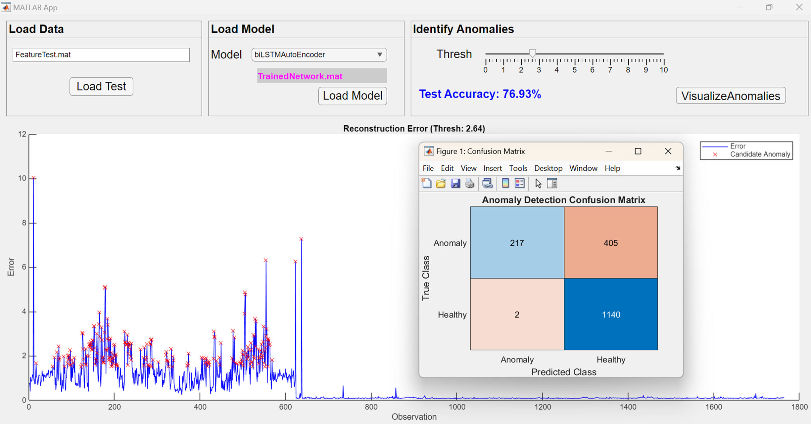

# Design APP Anomaly Detection by MATLAB App Designer

**Abstract :**

This app demonstrates how to detect anomalies in machinery operation by reconstructing sensor features using a trained **biLSTM autoencoder** model and comparing prediction errors against a defined threshold.

**Key :**

Using MATLAB tools and app building:

-  Built\-in Deep Learning & Signal Processing tools 

-  App Designer with UI components 

-  dlNetwork, predict, and custom helper functions 

 **Workflow :** 

1.  Import extracted feature table (from After Maintenance / Healthy Data)
2. Load trained model (net)
3. Predict all test data
4. Calculate reconstruction error
5. Use threshold to identify anomaly
6. Visualize results in app UI

**App UI :** 

-  UI has 3 main panels: 

-  **Load Data:** Choose .mat or .xlsx feature file 

-  **Load Model:** Select and load .mat LSTM model 

-  **Identify Anomalies:** Use slider to choose detection threshold and visualize predictions 

 

